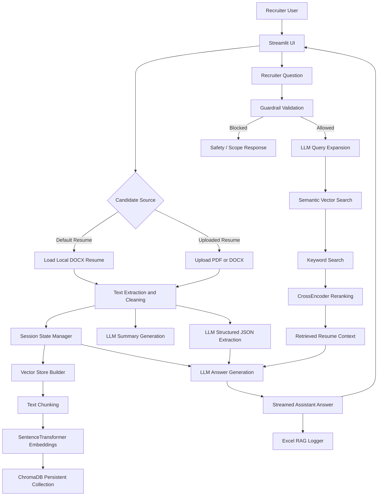

# 💼 Recruiter Assistant

A Streamlit-based **resume-aware recruiter assistant** that helps recruiters evaluate a candidate’s resume, generate concise summaries, extract structured resume metadata, and ask contextual questions using a Retrieval-Augmented Generation (RAG) pipeline.

The application supports a default candidate resume as well as uploaded candidate resumes in PDF or DOCX format. It combines resume parsing, vector search, semantic query expansion, reranking, guardrails, OpenAI-powered answers, and Excel-based interaction logging.

---

## Table of Contents

- [Overview](#overview)
- [Key Features](#key-features)
- [Architecture Diagram](#architecture-diagram)
- [Project Structure](#project-structure)
- [How It Works](#how-it-works)
- [Tech Stack](#tech-stack)
- [Setup Instructions](#setup-instructions)
- [Running the Application](#running-the-application)
- [Environment Variables](#environment-variables)
- [Usage Flow](#usage-flow)
- [Logging](#logging)
- [Guardrails and Safety](#guardrails-and-safety)
- [Potential Future Improvements](#potential-future-improvements)

---

## Overview

Recruiter Assistant is designed to help recruiters quickly understand a candidate’s profile and ask targeted questions about their resume. The system loads resume content, creates a vector store, generates a summary, extracts structured metadata, and answers recruiter questions using only the resume context.

The application is especially useful for:

- Resume screening
- Candidate skill analysis
- Experience and project evaluation
- Role-fit assessment
- Recruiter Q&A over resume content

---

## Key Features

### 1. Streamlit Web Interface

- Clean recruiter-focused UI built with Streamlit
- Sidebar candidate source selection
- Chat-style question-answering experience
- Candidate summary shown in an expandable panel
- Retrieved RAG context shown for transparency

### 2. Default and Uploaded Resume Support

- Loads a default resume from the local project directory
- Supports uploading candidate resumes in:
  - PDF format
  - DOCX format
- Automatically extracts and cleans text from uploaded resumes

### 3. Resume Text Extraction

- Extracts text from DOCX paragraphs and tables
- Extracts text from PDF pages
- Cleans spacing, line breaks, and formatting artifacts
- Provides fallback handling when extraction fails

### 4. RAG-Based Question Answering

- Splits resume text into overlapping chunks
- Embeds chunks using SentenceTransformers
- Stores chunks in a persistent ChromaDB vector store
- Searches relevant resume chunks using semantic similarity
- Adds keyword-based search for improved recall
- Reranks retrieved chunks using a CrossEncoder

### 5. Query Expansion

- Uses the LLM to generate multiple recruiter-focused search queries
- Improves retrieval by searching from different angles, such as:
  - Skills
  - Tools
  - Projects
  - Domains
  - Work experience

### 6. Candidate Summary Generation

- Generates a concise recruiter-style summary
- Focuses on specialization, technical skills, achievements, impact, and role fit
- Streams the summary into the Streamlit interface

### 7. Structured Resume Metadata Extraction

- Extracts structured JSON fields such as:
  - LinkedIn, GitHub, portfolio, and other profile links
  - Experience history
  - Education details
- Normalizes dates and returns machine-readable resume metadata

### 8. Guardrails for Safe Recruiter Scope

- Blocks empty questions
- Detects prompt-injection and jailbreak-style attempts
- Keeps the assistant focused on resume-related questions
- Prevents attempts to reveal hidden prompts, secrets, API keys, or system files

### 9. Chat History Support

- Maintains active conversation history in Streamlit session state
- Sends prior user and assistant turns to the LLM for contextual continuity
- Resets chat state when switching resumes or clearing chat

### 10. Excel Logging

- Logs each RAG interaction to an Excel file
- Captures:
  - User question
  - Retrieved context
  - Generated answer
  - Response time
- Useful for debugging, evaluation, audit trails, and performance tracking

---

## Architecture Diagram



---

## Project Structure

```text
.
├── main.py              # Streamlit application entry point
├── file_reader.py       # Resume loading, PDF/DOCX extraction, and text cleaning
├── vector_store.py      # ChromaDB vector store, embeddings, retrieval, keyword search, reranking
├── llm.py               # OpenAI summary, JSON extraction, Q&A, and query expansion logic
├── guardrails.py        # Prompt-injection checks and recruiter-scope validation
├── excel_logger.py      # Excel-based RAG interaction logging
├── my_resume/           # Default resume directory
├── VectorStore/         # Persistent ChromaDB storage
├── rag_logs.xlsx        # Generated interaction log file
└── .env                 # Environment variables
```

---

## How It Works

1. **Resume Selection**
   - The recruiter selects either the default resume or uploads a candidate resume.

2. **Text Extraction**
   - The system extracts text from DOCX or PDF files and cleans the result.

3. **Vector Store Preparation**
   - Resume text is split into small overlapping chunks.
   - Chunks are embedded using a SentenceTransformer model.
   - Embeddings are stored in ChromaDB.

4. **Summary and Metadata Extraction**
   - The LLM generates a short recruiter summary.
   - The LLM extracts structured resume metadata as JSON.

5. **Question Validation**
   - User questions are checked against prompt-injection and unsafe instruction patterns.

6. **Query Expansion**
   - The LLM creates additional search queries to improve retrieval coverage.

7. **Retrieval and Reranking**
   - Semantic search retrieves relevant chunks.
   - Keyword search adds lexical matches.
   - A CrossEncoder reranks the combined results.

8. **Answer Generation**
   - The LLM answers using the retrieved context and structured resume metadata.
   - If relevant chunks are unavailable, the system falls back to the full resume text.

9. **Logging**
   - Each question, context, answer, and response time is stored in `rag_logs.xlsx`.

---

## Tech Stack

- **Python**
- **Streamlit** for the web interface
- **OpenAI Responses API** for summary, structured extraction, query expansion, and answers
- **ChromaDB** for persistent vector storage
- **SentenceTransformers** for embeddings
- **CrossEncoder** for reranking
- **LangChain Text Splitters** for resume chunking
- **PyPDF2** for PDF extraction
- **python-docx** for DOCX extraction
- **Pandas / OpenPyXL** for Excel logging
- **python-dotenv** for environment variable loading

---

## Setup Instructions

### 1. Clone or Download the Project

```bash
git clone <your-repository-url>
cd <your-project-folder>
```

### 2. Create a Virtual Environment

```bash
python -m venv venv
```

Activate it:

```bash
# Windows
venv\Scripts\activate

# macOS / Linux
source venv/bin/activate
```

### 3. Install Dependencies

```bash
pip install streamlit openai python-dotenv chromadb sentence-transformers langchain-text-splitters PyPDF2 python-docx pandas openpyxl
```

### 4. Add Environment Variables

Create a `.env` file in the project root:

```env
OPENAI_API_KEY=your_openai_api_key_here
BASE_MODEL=your_preferred_openai_model
```

Example:

```env
BASE_MODEL=gpt-4.1-mini
```

### 5. Add Default Resume

For the default candidate flow, place the default resume at:

```text
my_resume/Chaitanya_Kumar_Reddy.docx
```

---

## Running the Application

```bash
streamlit run main.py
```

Then open the Streamlit URL shown in your terminal.

---

## Environment Variables

| Variable | Required | Description |
|---|---:|---|
| `OPENAI_API_KEY` | Yes | API key used by the OpenAI client |
| `BASE_MODEL` | Yes | Model name used for summary generation, extraction, query expansion, and Q&A |

---

## Usage Flow

1. Open the Streamlit app.
2. Choose the default resume or upload a candidate resume.
3. Wait for the vector store, summary, and structured data extraction to complete.
4. Ask recruiter-style questions, such as:
   - “What are this candidate’s strongest technical skills?”
   - “Is this candidate suitable for an AI Engineer role?”
   - “What projects show measurable business impact?”
   - “What experience does the candidate have with NLP or LLMs?”
5. Review the answer and optionally inspect retrieved context.
6. Check `rag_logs.xlsx` for logged interactions.

---

## Logging

The application logs each interaction into `rag_logs.xlsx` with the following columns:

| Column | Description |
|---|---|
| `Question` | Recruiter’s question |
| `Context` | Retrieved resume context used for answering |
| `Answer` | Assistant-generated answer |
| `response_time` | Time taken to generate the response |

This is useful for:

- Debugging retrieval quality
- Measuring latency
- Reviewing answer quality
- Building evaluation datasets
- Auditing recruiter interactions

---

## Guardrails and Safety

The project includes guardrails to keep the assistant focused and safe.

The validation layer detects attempts such as:

- Ignoring prior instructions
- Revealing hidden prompts
- Requesting API keys or secrets
- Accessing private files
- Running system commands
- Jailbreak-style prompts

When a question is unsafe or outside scope, the assistant returns a controlled response instead of calling retrieval or the LLM.

---

## Potential Future Improvements

### 1. Stronger Off-Topic Filtering

The current guardrail system focuses heavily on prompt-injection detection. A future enhancement could add explicit topic classification to block non-recruiting questions more reliably.

### 2. Better Resume Parsing

Add support for:

- Images and scanned resumes using OCR
- More robust PDF layout extraction
- Tables, columns, and section-aware parsing
- Multiple resumes uploaded at once

### 3. Candidate Comparison Mode

Allow recruiters to upload multiple resumes and compare candidates across:

- Skills
- Years of experience
- Project impact
- Role fit
- Education
- Domain expertise

### 4. Evaluation Dashboard

Add a dashboard for reviewing:

- Average response time
- Most common recruiter questions
- Retrieval success rate
- LLM answer confidence
- Guardrail block counts

### 5. Improved Logging and Analytics

Enhance Excel logging with:

- Timestamp
- Candidate name
- Collection name
- Retrieved chunk IDs
- Model name
- Token usage
- Guardrail status
- User feedback rating

### 6. Authentication and Role-Based Access

For production use, add:

- Recruiter login
- Admin roles
- Candidate data access controls
- Audit trails
- Secure session handling

### 7. Persistent Candidate Library

Store candidate resumes and extracted metadata in a database so recruiters can search and revisit previous candidates.

Possible additions:

- PostgreSQL metadata store
- S3 or cloud storage for resumes
- Candidate profile pages
- Search by skill, company, role, or education

### 8. Better RAG Evaluation

Improve retrieval and answer quality with:

- Retrieval precision/recall tests
- Golden Q&A datasets
- Human evaluation workflow
- Hallucination checks
- Context relevance scoring

### 9. More Advanced Reranking

Experiment with:

- Larger CrossEncoder rerankers
- Hybrid BM25 + vector retrieval
- Metadata-aware ranking
- Section-aware chunk scoring

### 10. Deployment Enhancements

Prepare the project for deployment with:

- Dockerfile
- CI/CD pipeline
- Cloud deployment instructions
- Secrets management
- Health checks
- Logging and monitoring

### 11. More Structured Output Options

Add recruiter-friendly export formats, such as:

- Candidate scorecards
- PDF summaries
- Interview question lists
- Skill matrix reports
- JSON API responses

### 12. Privacy and Compliance Improvements

Because resumes may contain personal data, future versions should include:

- Data retention controls
- Resume deletion workflow
- Encryption at rest
- PII redaction options
- Compliance documentation

---

## Summary

Recruiter Assistant provides a practical RAG-based workflow for resume analysis. It combines document ingestion, vector search, LLM-powered summarization, structured extraction, guarded Q&A, and interaction logging into a recruiter-friendly Streamlit application.

The current version is well suited for local resume screening and experimentation. With stronger parsing, analytics, authentication, and deployment hardening, it can evolve into a more production-ready recruiting intelligence tool.
