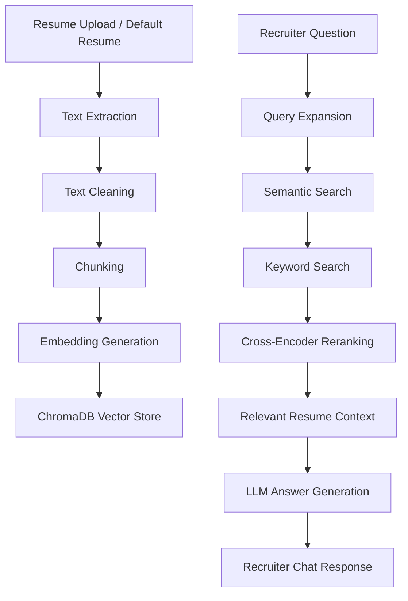

# 💼 Recruiter Assistant — AI Resume Intelligence App

Recruiter Assistant is an AI-powered resume analysis tool that helps recruiters, hiring managers, and talent teams understand a candidate’s profile faster, more accurately, and with far less manual screening effort.

Instead of scanning resumes line by line, recruiters can upload a resume and ask natural-language questions such as:

- “Is this candidate a good fit for an ML Engineer role?”
- “Summarize their strongest technical achievements.”
- “What projects show real-world NLP or LLM experience?”
- “Does this candidate have production deployment experience?”
- “What are the measurable outcomes in this resume?”

The app uses a Retrieval-Augmented Generation (RAG) pipeline to retrieve the most relevant resume sections, then generates grounded answers using an LLM.

---

## ✨ Why Recruiters Will Love It

Recruiters often spend only a few seconds scanning each resume. This project turns that process into an interactive AI experience.

With Recruiter Assistant, recruiters can:

✅ Instantly summarize a candidate profile  
✅ Ask role-specific screening questions  
✅ Extract structured resume metadata  
✅ Compare skills, tools, projects, and experience  
✅ View the exact retrieved resume context behind each answer  
✅ Reduce manual resume reading time  
✅ Make screening more consistent and explainable  

This is not just a resume chatbot. It is a recruiter-focused decision-support assistant.

---

## 🔎 What Makes the Search Intelligent

Recruiter Assistant does not simply send the full resume to the LLM.

It uses a layered retrieval pipeline designed to find the most relevant evidence before generating an answer.

### Query Expansion

Recruiter questions can be vague or phrased differently from the resume.

For example, a recruiter may ask:

```text
Does this candidate have GenAI experience?
```

The app expands that into multiple search angles such as:

```text
LLM applications
RAG systems
NLP projects
generative AI tools
```

This helps the system retrieve better evidence from the resume, even when the exact wording does not match.

### Semantic Search

The app uses Sentence Transformer embeddings to understand meaning, not just exact words.

So if a resume says:

```text
Built an NLP-based document intelligence system
```

and the recruiter asks:

```text
Has this candidate worked on AI automation?
```

semantic search can still find relevant chunks because the meaning is related.

### Keyword Search

Keyword search is added alongside semantic search to catch exact terms, tools, company names, role names, certifications, and technologies.

This is useful for questions like:

```text
Has the candidate used ChromaDB?
```

or:

```text
Does the resume mention AWS?
```

### Hybrid Search

The app combines:

- Semantic vector search
- Keyword-based search
- Deduplication of retrieved chunks

This hybrid approach improves both recall and precision.

Semantic search finds conceptually relevant resume sections, while keyword search makes sure exact matches are not missed.

### Cross-Encoder Reranking

After collecting candidate chunks, the app reranks them using a cross-encoder model.

This step compares the recruiter question directly against each retrieved resume chunk and selects the strongest evidence before sending context to the LLM.

### Grounded Generation

The LLM receives only the selected resume context and structured metadata.

This helps produce concise, recruiter-friendly answers while reducing hallucinations.

---

## 🚀 Demo Experience

The app starts with a default candidate resume and also supports uploading a new candidate resume.

### Candidate Source

Recruiters can choose between:

1. **Default Resume**
   - Loads the built-in candidate profile.
   - Useful for demoing the application instantly.

2. **Upload Candidate Resume**
   - Supports PDF and DOCX resumes.
   - Automatically extracts resume text.
   - Creates a dedicated vector store collection for that candidate.

### AI-Powered Candidate Summary

Once a resume is loaded, the app generates a concise recruiter-style summary covering:

- Candidate specialization
- Core technical skills
- Key tools and technologies
- Measurable achievements
- Overall role-fit assessment

### Resume-Aware Chat

Recruiters can ask questions in a chat interface, and the assistant answers using only the resume content.

Example questions:

```text
What are this candidate’s strongest AI/ML skills?
```

```text
Has this candidate worked with LLMs or RAG systems?
```

```text
What impact did this candidate create in previous roles?
```

```text
Is this candidate suitable for a Data Scientist role?
```

---

## 🧠 How It Works

Recruiter Assistant uses a production-style RAG pipeline:



### Pipeline Breakdown

| Step | Description |
|---|---|
| Resume Parsing | Extracts resume text from PDF or DOCX files |
| Text Cleaning | Normalizes spacing, line breaks, and formatting noise |
| Chunking | Splits resumes into smaller searchable sections |
| Embedding Generation | Converts resume chunks into semantic vectors using Sentence Transformers |
| Query Expansion | Rewrites the recruiter question into multiple skill, project, tool, and domain-focused search queries |
| Semantic Search | Searches ChromaDB for resume chunks that are meaningfully related to the recruiter question |
| Keyword Search | Finds exact keyword/tool/company/skill matches that semantic search may miss |
| Hybrid Retrieval | Combines semantic results and keyword results into one candidate context pool |
| Deduplication | Removes repeated chunks before reranking |
| Cross-Encoder Reranking | Scores question-chunk pairs and selects the most relevant resume evidence |
| Context Grounding | Sends only the selected resume context and structured metadata to the LLM |
| LLM Answer Generation | Produces concise, professional, recruiter-friendly answers |
| RAG Logging | Saves the question, retrieved context, answer, and response time for evaluation |

---

## 🛠️ Tech Stack

| Category | Tools |
|---|---|
| Frontend | Streamlit |
| LLM Provider | OpenAI Responses API |
| Vector Database | ChromaDB |
| Embeddings | Sentence Transformers |
| Reranking | Cross Encoder |
| Document Parsing | PyPDF2, python-docx |
| Text Splitting | LangChain Text Splitters |
| Logging | Pandas, Excel |
| Environment Management | Python, dotenv |

---

## 🧩 Retrieval Components Used

| Component | Implementation |
|---|---|
| Embedding Model | `all-MiniLM-L6-v2` from Sentence Transformers |
| Vector Database | ChromaDB persistent collections |
| Text Splitter | RecursiveCharacterTextSplitter |
| Semantic Retrieval | ChromaDB vector similarity search |
| Keyword Retrieval | Regex/token overlap keyword scoring |
| Hybrid Retrieval | Combined semantic + keyword results |
| Reranker | `cross-encoder/ms-marco-MiniLM-L-6-v2` |
| LLM Interface | OpenAI Responses API |
| Logging | Excel-based RAG interaction logs |

---

## 📂 Project Structure

```text
Recruiter-Assistant/
│
├── main.py              # Streamlit application and user interface
├── vector_store.py      # ChromaDB vector store, embeddings, search, reranking
├── llm.py               # LLM calls for summary, extraction, Q&A, query expansion
├── file_reader.py       # PDF/DOCX resume parsing and text cleaning
├── excel_logger.py      # Logs RAG interactions to Excel
├── requirements.txt     # Python dependencies
├── pyproject.toml       # Project metadata/config
├── uv.lock              # Locked dependency versions
│
├── my_resume/
│   └── Candidate_Resume.docx
│
└── VectorStore/
    └── ChromaDB persistent collections
```

---

## ⚙️ Installation

### 1. Clone the repository

```bash
git clone https://github.com/your-username/recruiter-assistant.git
cd recruiter-assistant
```

### 2. Create a virtual environment

```bash
python -m venv .venv
```

Activate it:

```bash
# macOS / Linux
source .venv/bin/activate
```

```bash
# Windows
.venv\Scripts\activate
```

### 3. Install dependencies

```bash
pip install -r requirements.txt
```

### 4. Add environment variables

Create a `.env` file:

```env
OPENAI_API_KEY=your_openai_api_key
BASE_MODEL=gpt-4.1-mini
```

You can replace `BASE_MODEL` with another OpenAI model depending on your cost, speed, and quality requirements.

### 5. Add a default resume

Place your default demo resume here:

```text
my_resume/Chaitanya_Kumar_Reddy.docx
```

Or update the default path in `file_reader.py`.

### 6. Run the app

```bash
streamlit run main.py
```

---

## 💡 Key Features

### 1. Candidate Resume Upload

Upload a candidate resume in PDF or DOCX format.

The app extracts text, cleans it, chunks it, embeds it, and creates a searchable vector collection.

---

### 2. AI Candidate Summary

The app generates a concise two-paragraph recruiter summary designed to be easy to scan and useful for initial screening.

It focuses on:

- Candidate specialization
- Technical skills
- Tools and frameworks
- Measurable achievements
- Role-fit signal

---

### 3. Structured Resume Extraction

The system extracts structured metadata such as:

- LinkedIn
- GitHub
- Portfolio
- Experience
- Education
- Dates
- Companies
- Roles

This creates a foundation for future filtering, candidate comparison, and CRM-style workflows.

---

### 4. Query Expansion

Recruiter questions are automatically expanded into multiple search angles before retrieval.

For example:

```text
Does this candidate have GenAI experience?
```

May become:

```text
generative AI projects
LLM applications
RAG systems
NLP experience
```

This improves retrieval quality because resumes and recruiters often use different wording for the same skill or experience.

---

### 5. Semantic Search

The app uses embedding-based semantic search to retrieve resume chunks based on meaning.

This helps answer questions even when the recruiter’s wording does not exactly match the resume.

Example:

```text
Recruiter asks: Has this candidate worked on AI automation?
Resume says: Built an NLP-based document intelligence pipeline.
```

Semantic search can still identify the relationship between the two.

---

### 6. Keyword Search

The app also performs keyword search over resume chunks.

This helps catch exact terms such as:

- Programming languages
- Frameworks
- Tools
- Certifications
- Company names
- Job titles
- Cloud platforms

Keyword search is especially important when a recruiter wants to verify whether a specific technology is mentioned.

---

### 7. Hybrid Search

The app combines semantic search and keyword search into a hybrid retrieval system.

This gives the assistant the best of both worlds:

| Search Type | Strength |
|---|---|
| Semantic Search | Finds meaning-based matches |
| Keyword Search | Finds exact terms and tools |
| Hybrid Search | Improves recall and answer quality |

---

### 8. Cross-Encoder Reranking

After semantic and keyword results are combined, the app reranks the retrieved chunks using a cross-encoder.

The cross-encoder directly compares the recruiter question with each resume chunk and selects the most relevant evidence.

This makes the final answer more accurate and grounded.


---

### 9. Retrieved Context Viewer

Recruiters can open a retrieved-context panel to see which resume chunks were used.

This makes the assistant more transparent and trustworthy.

---

### 10. RAG Logging

Each interaction is logged with:

- Recruiter question
- Retrieved context
- Generated answer
- Response time

This is useful for evaluation, debugging, prompt improvement, and measuring product quality over time.

---

## 🧪 Example Use Cases

### For Recruiters

- Quickly screen resumes
- Identify role-fit signals
- Extract candidate highlights
- Prepare hiring manager summaries
- Ask follow-up questions without rereading the resume

### For Hiring Managers

- Understand candidate strengths
- Validate technical claims
- Compare candidate experience against role requirements
- Identify missing information

### For Candidates

- Turn a resume into an interactive portfolio
- Demo skills in AI, RAG, LLMs, and product thinking
- Show recruiters a more engaging way to explore experience

---

## 📊 Example Questions to Ask

```text
Summarize this candidate in 5 bullet points.
```

```text
What are the candidate’s strongest technical skills?
```

```text
What measurable achievements are mentioned?
```

```text
Does this candidate have experience with cloud platforms?
```

```text
What projects demonstrate machine learning experience?
```

```text
Is this candidate better suited for data science, ML engineering, or software engineering?
```

```text
What should a recruiter highlight when pitching this candidate?
```

```text
What information is missing from this resume?
```

---

## 🔐 Grounded Answering

The assistant is instructed to answer only using the provided resume context.

If the answer is not present in the resume, it responds:

```text
Not mentioned in the resume.
```

This reduces hallucinations and keeps recruiter responses grounded in candidate-provided evidence.

---

## 🏗️ Production Improvements Planned

This project is already functional, but the next production-level upgrades include:

- Parse and validate extracted JSON
- Add OCR support for scanned PDF resumes
- Add job description matching
- Compare multiple candidates against one job description
- Add candidate ranking and scoring
- Store logs in SQLite or Postgres instead of Excel
- Add authentication
- Add cloud deployment
- Add recruiter notes and candidate shortlisting
- Add exportable hiring manager summaries
- Add evaluation metrics for retrieval quality
- Add resume red-flag and missing-info detection
- Add UI cards for skills, experience, education, and projects

---

## 🌟 Future Vision

Recruiter Assistant can evolve into a full AI recruiting copilot:

- Upload a job description
- Upload multiple resumes
- Rank candidates by fit
- Generate interview questions
- Identify skill gaps
- Create recruiter pitch notes
- Generate hiring manager summaries
- Maintain candidate screening history
- Integrate with ATS platforms

The goal is simple:

> Help recruiters spend less time searching resumes and more time making great hiring decisions.

---

## 📸 Suggested LinkedIn Screenshots

For a strong LinkedIn post, include screenshots of:

1. Candidate source selector
2. Auto-generated candidate summary
3. Chat question and AI answer
4. Retrieved context expander
5. Uploaded resume workflow
6. RAG architecture diagram

---

## 🧑‍💻 Author

Built as an AI recruiting assistant project to demonstrate practical skills in:

- LLM application development
- Retrieval-Augmented Generation
- Vector databases
- Semantic search
- Prompt engineering
- Streamlit product development
- AI workflow design
- Recruiter-focused product thinking

---

## ⭐ LinkedIn Caption Idea

I built an AI-powered Recruiter Assistant that turns resumes into an interactive chat experience.

Instead of manually scanning a resume, recruiters can upload a candidate profile and ask questions like:

- “Is this candidate a good fit for an ML Engineer role?”
- “What are their strongest technical skills?”
- “What measurable impact have they delivered?”
- “What should I highlight to a hiring manager?”

Under the hood, the app uses a RAG pipeline with ChromaDB, Sentence Transformers, query expansion, hybrid retrieval, cross-encoder reranking, and OpenAI’s Responses API.

This project helped me combine AI engineering with real recruiting workflows — building something that is not just technically interesting, but genuinely useful.

#AI #Recruiting #RAG #LLM #MachineLearning #Streamlit #OpenAI #VectorDatabase #GenAI
